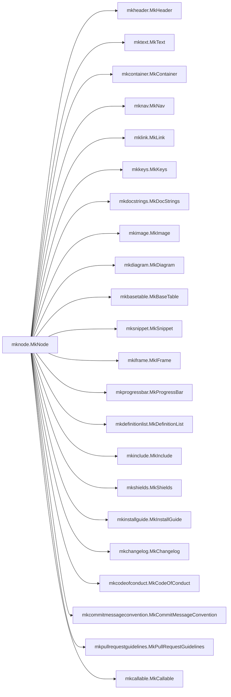

``` py title='mknodes.manual.root.create_github_index_md' linenums="80" hl_lines="3"
def create_github_index_md():
    page = mknodes.MkPage("Github index")
    page += mknodes.MkCode.for_object(create_github_index_md)
    page += mknodes.MkHeader("MkNodes", level=1)
    page += mknodes.MkHeader("Don't write docs. Code them.", level=4)
    page += mknodes.MkShields(
        ["build", "version", "status", "black"],
        user="phil65",
        project="mknodes",
    )
    page += mknodes.MkLink(
        "https://phil65.github.io/mknodes/",
        "Read the completely coded documentation!",
    )
    page += mknodes.MkInstallGuide("mknodes", header="How to install")
    page += mknodes.MkClassDiagram(
        mknodes.MkNode,
        mode="subclass_tree",
        max_depth=1,
        direction="LR",
        header="All the nodes!"
    )
    return page

```

# MkNodes

#### Don't write docs. Code them.

[](https://github.com/phil65/mknodes/actions/)
[](https://pypi.org/project/mknodes/)
[](https://pypi.org/project/mknodes/)
[](https://github.com/psf/black)

[Read the completely coded documentation!](https://phil65.github.io/mknodes/)

## How to install

### pip


The latest released version is available at the [Python
package index](https://pypi.org/project/mknodes).

```sh
pip install mknodes
```


## All the nodes!


``` py title='__main__.create_github_index_md' linenums="80" hl_lines="3"
def create_github_index_md():
    page = mknodes.MkPage("Github index")
    page += mknodes.MkCode.for_object(create_github_index_md)
    page += mknodes.MkHeader("MkNodes", level=1)
    page += mknodes.MkHeader("Don't write docs. Code them.", level=4)
    page += mknodes.MkShields(
        ["build", "version", "status", "black"],
        user="phil65",
        project="mknodes",
    )
    page += mknodes.MkLink(
        "https://phil65.github.io/mknodes/",
        "Read the completely coded documentation!",
    )
    page += mknodes.MkInstallGuide("mknodes", header="How to install")
    page += mknodes.MkClassDiagram(
        mknodes.MkNode,
        mode="subclass_tree",
        max_depth=1,
        direction="LR",
        header="All the nodes!"
    )
    return page

```

# MkNodes

#### Don't write docs. Code them.

[](https://github.com/phil65/mknodes/actions/)
[](https://pypi.org/project/mknodes/)
[](https://pypi.org/project/mknodes/)
[](https://github.com/psf/black)

[Read the completely coded documentation!](https://phil65.github.io/mknodes/)

## How to install

### pip


The latest released version is available at the [Python
package index](https://pypi.org/project/mknodes).

```sh
pip install mknodes
```


## All the nodes!


