``` py title='__main__.create_github_index_md' linenums="82" hl_lines="3"
def create_github_index_md() -> mknodes.MkPage:
    page = mknodes.MkPage("Github index")
    page += mknodes.MkCode.for_object(create_github_index_md)
    page += mknodes.MkHeader("MkNodes", level=1)
    page += mknodes.MkHeader("Don't write docs. Code them.", level=4)
    page += mknodes.MkShields()
    page += mknodes.MkLink(DOC_URL, "Read the completely coded documentation!")
    page += mknodes.MkInstallGuide(header="How to install")
    page += mknodes.MkHeader("All the nodes!")
    page += mknodes.MkClassDiagram(mknodes.MkNode, mode="subclasses", direction="LR")
    return page

```

# MkNodes

#### Don't write docs. Code them.

[](https://pypi.org/project/mknodes/)
[](https://pypi.org/project/mknodes/)
[](https://pypi.org/project/mknodes/)
[](https://pypi.org/project/mknodes/)
[](https://pypi.org/project/mknodes/)
[](https://pypi.org/project/mknodes/)
[](https://pypi.org/project/mknodes/)
[](https://pypi.org/project/mknodes/)
[](https://pypi.org/project/mknodes/)
[](https://github.com/phil65/mknodes/releases)
[](https://github.com/phil65/mknodes/graphs/contributors)
[](https://github.com/phil65/mknodes/discussions)
[](https://github.com/phil65/mknodes/forks)
[](https://github.com/phil65/mknodes/issues)
[](https://github.com/phil65/mknodes/pulls)
[](https://github.com/phil65/mknodes/watchers)
[](https://github.com/phil65/mknodes/stars)
[](https://github.com/phil65/mknodes)
[](https://github.com/phil65/mknodes/commits)
[](https://github.com/phil65/mknodes/releases)
[](https://github.com/phil65/mknodes)
[](https://github.com/phil65/mknodes)
[](https://github.com/phil65/mknodes)
[](https://github.com/phil65/mknodes)
[](https://codecov.io/gh/phil65/mknodes/)
[](https://github.com/psf/black)
[](https://pyup.io/repos/github/phil65/mknodes/)

[Read the completely coded documentation!](https://phil65.github.io/mknodes/)

## How to install

### pip

The latest released version is available at the [Python package index](https://pypi.org/project/mknodes).

``` py
pip install mknodes
```

## All the nodes!

``` mermaid
graph LR
  2221091714352["mknode.MkNode"]
  2221091724112["mkheader.MkHeader"]
  2221091722160["mktext.MkText"]
  2221092966336["mkchangelog.MkChangelog"]
  2221092971216["mkcodeofconduct.MkCodeOfConduct"]
  2221093014160["mklicense.MkLicense"]
  2221091715328["mkcontainer.MkContainer"]
  2221091710448["mkblock.MkBlock"]
  2221091712400["mkhtmlblock.MkHtmlBlock"]
  2221091717280["mkadmonitionblock.MkAdmonitionBlock"]
  2221091718256["mkdetailsblock.MkDetailsBlock"]
  2221091469376["mktabs.MkTabBlock"]
  2221091719232["mkadmonition.MkAdmonition"]
  2221091721184["mkblockquote.MkBlockQuote"]
  2221091467424["mkfootnotes.MkFootNote"]
  2221091479136["mkfootnotes.MkFootNotes"]
  2221091482064["mkpage.MkPage"]
  2221091507440["mktemplatepage.MkTemplatePage"]
  2221091514272["mkclasspage.MkClassPage"]
  2221091501584["mkmodulepage.MkModulePage"]
  2221091466448["mkgrid.MkGridCard"]
  2221091472304["mkgrid.MkGrid"]
  2221091488896["mkcode.MkCode"]
  2221091474256["mkdiagram.MkDiagram"]
  2221091478160["mkclassdiagram.MkClassDiagram"]
  2221092976096["mktreeview.MkTreeView"]
  2221092980000["mkprettyprint.MkPrettyPrint"]
  2221092995616["mklog.MkLog"]
  2221093038560["mkcommandoutput.MkCommandOutput"]
  2221091475232["mklist.MkList"]
  2221091489872["mkbasetable.MkBaseTable"]
  2221091471328["mktable.MkTable"]
  2221091497680["mkclasstable.MkClassTable"]
  2221093027824["mkdependencytable.MkDependencyTable"]
  2221093033680["mkmoduletable.MkModuleTable"]
  2221091483040["mktabs.MkTab"]
  2221091470352["mktabcontainer.MkTabContainer"]
  2221091484016["mktabcontainer.MkTabbed"]
  2221092977072["mkreprrawrendered.MkReprRawRendered"]
  2221091460592["mktabcontainer.MkTabbedBlocks"]
  2221091484992["mkcritic.MkCritic"]
  2221091480112["mkannotations.MkAnnotation"]
  2221091476208["mkannotations.MkAnnotations"]
  2221091487920["mkdefinitionlist.MkDefinitionList"]
  2221091503536["mkshields.MkShields"]
  2221091517200["mkinstallguide.MkInstallGuide"]
  2221092969264["mkcommitconventions.MkCommitConventions"]
  2221092970240["mkpullrequestguidelines.MkPullRequestGuidelines"]
  2221092974144["mkdevenvsetup.MkDevEnvSetup"]
  2221091465472["mknav.MkNav"]
  2221091515248["mkdoc.MkDoc"]
  2221091491824["mklink.MkLink"]
  2221091486944["mkkeys.MkKeys"]
  2221091463520["mkdocstrings.MkDocStrings"]
  2221091481088["mkimage.MkImage"]
  2221091468400["mkbinaryimage.MkBinaryImage"]
  2221093042464["mkbadge.MkBadge"]
  2221091473280["mksnippet.MkSnippet"]
  2221091485968["mkiframe.MkIFrame"]
  2221091492800["mkprogressbar.MkProgressBar"]
  2221091502560["mkinclude.MkInclude"]
  2221093000496["mkcallable.MkCallable"]
  2221091714352 --> 2221091724112
  2221091714352 --> 2221091722160
  2221091722160 --> 2221092966336
  2221091722160 --> 2221092971216
  2221091722160 --> 2221093014160
  2221091714352 --> 2221091715328
  2221091715328 --> 2221091710448
  2221091710448 --> 2221091712400
  2221091710448 --> 2221091717280
  2221091710448 --> 2221091718256
  2221091710448 --> 2221091469376
  2221091715328 --> 2221091719232
  2221091715328 --> 2221091721184
  2221091715328 --> 2221091467424
  2221091715328 --> 2221091479136
  2221091715328 --> 2221091482064
  2221091482064 --> 2221091507440
  2221091507440 --> 2221091514272
  2221091507440 --> 2221091501584
  2221091715328 --> 2221091466448
  2221091715328 --> 2221091472304
  2221091715328 --> 2221091488896
  2221091488896 --> 2221091474256
  2221091474256 --> 2221091478160
  2221091488896 --> 2221092976096
  2221091488896 --> 2221092980000
  2221091488896 --> 2221092995616
  2221091488896 --> 2221093038560
  2221091715328 --> 2221091475232
  2221091715328 --> 2221091489872
  2221091489872 --> 2221091471328
  2221091471328 --> 2221091497680
  2221091471328 --> 2221093027824
  2221091471328 --> 2221093033680
  2221091715328 --> 2221091483040
  2221091715328 --> 2221091470352
  2221091470352 --> 2221091484016
  2221091484016 --> 2221092977072
  2221091470352 --> 2221091460592
  2221091715328 --> 2221091484992
  2221091715328 --> 2221091480112
  2221091715328 --> 2221091476208
  2221091715328 --> 2221091487920
  2221091715328 --> 2221091503536
  2221091715328 --> 2221091517200
  2221091715328 --> 2221092969264
  2221091715328 --> 2221092970240
  2221091715328 --> 2221092974144
  2221091714352 --> 2221091465472
  2221091465472 --> 2221091515248
  2221091714352 --> 2221091491824
  2221091714352 --> 2221091486944
  2221091714352 --> 2221091463520
  2221091714352 --> 2221091481088
  2221091481088 --> 2221091468400
  2221091468400 --> 2221093042464
  2221091714352 --> 2221091473280
  2221091714352 --> 2221091485968
  2221091714352 --> 2221091492800
  2221091714352 --> 2221091502560
  2221091714352 --> 2221093000496
```


